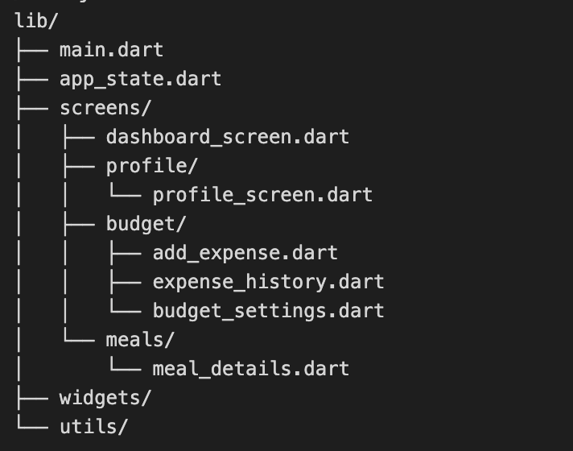

🌿 GreenWallet

A sustainable budgeting and eco-lifestyle companion app built with Flutter and Provider.
GreenWallet helps users track their spending, set smart budgets, discover eco-friendly meal suggestions, and build healthier, greener habits.

📌 Overview

GreenWallet combines personal finance with sustainability awareness.
It encourages users to spend smarter while learning how lifestyle choices impact health and the environment.

✨ Features
💰 Smart Budget Tracking

Set and update a monthly budget

Add expenses with category, amount, and description

Visual budget progress indicator on Dashboard

Complete expense history list

🥗 Meal Suggestions & Favorites

Scroll through eco-friendly meal ideas

Tap a suggestion to save it to your Favorites

Favorites appear above the suggestions for fast access

Designed to promote sustainable and healthy eating

🌎 Eco & Health Insights (Future Feature)

Carbon savings tracker

Eco level progression

Health meal scoring

🏆 Leaderboard (Future Feature)

Compare eco scores with friends and other users

🛠 Tech Stack

Flutter (Dart)

Provider for state management

Material 3 UI design

Cross-platform support: iOS, Android, Web, Desktop

📁 Project Structure

Getting Started
1️⃣ Clone the Repository
git clone https://github.com/LNR1001/GreenWallet.git
cd GreenWallet

2️⃣ Install Dependencies

Make sure Flutter is installed:

flutter --version

Install required packages:

flutter pub get

3️⃣ Run the App
▶️ Web
flutter run -d chrome

▶️ Android
flutter emulators --launch <emulator_name>
flutter run

▶️ iOS (Mac only)
open -a Simulator
flutter run
